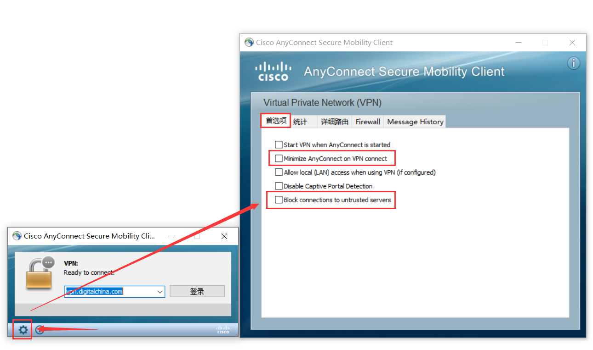
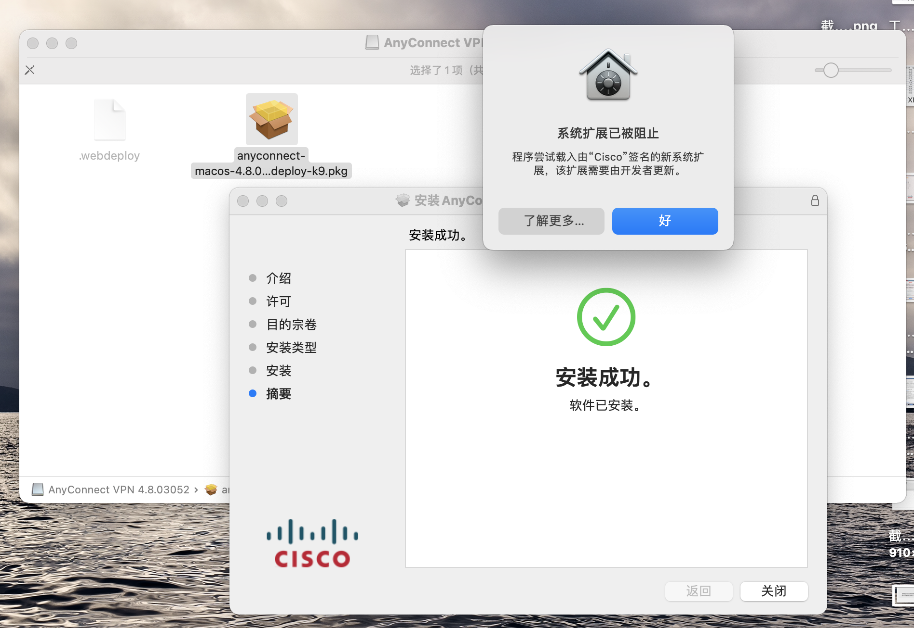
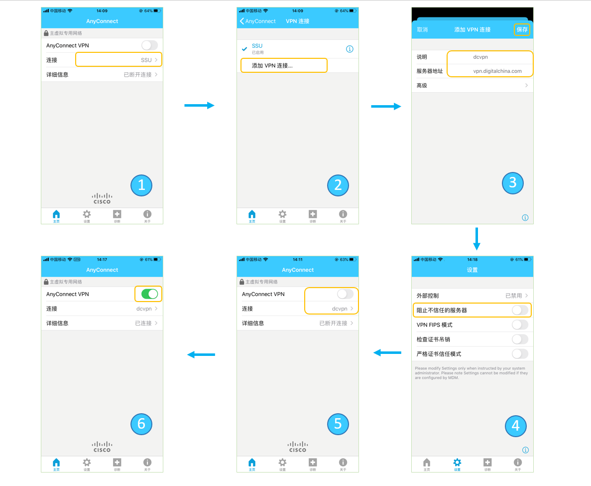
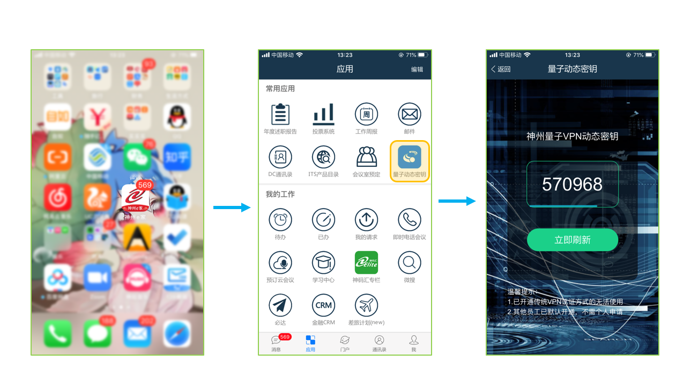

# 神州数码VPN安装配置说明

### 前言

VPN是移动办公必备的工具之一，连接VPN需要具备**`VPN客户端`**，以及**`动态密钥`**,下面将对如何获取VPN客户端及动态密钥做详细说明

### 1. 软件下载

​	访问https://it.digitalchina.com/vpn (或`企业微信`--`微盘`--`DCONE IT工具`--`VPN`)，按照使用的操作系统下载对应的安装包即可（目前支持的操作系统/平台 包括：Windows/MacOS/~~Linux~~/iOS/Android)

### 2. 软件安装

- > Windows

  - 下载安装`anyconnect-win-x.x.xxxxx-core-vpn.exe`或`anyconnect-win-`arm64`-x.x.xxxxx-core-vpn.exe`安装包，双击按照安装向导提示，直至安装结束即可

  - 打开VPN客户端（Cisco AnyConnect Secure Mobility Client)，依次选择`设置`--`首选项/Preference`--取消勾选 "`Minimize Anyconnect on VPN connect`"和 "`Block connections to untrusted servers`"

  

- > MacOS

  - 下载安装`anyconnect-macos-x.x.xxxxx-core-vpn.dmg`安装包，双击按照安装向导提示进行安装，安装结束后关闭相应提示窗口即可

    

  - 打开AnyConnect首选项，取消勾选"`Block connections to untrusted servers`"

    

- > 移动终端（iOS/Android)

  - 通过访问下载页面进行扫码，或者应用商店下载Cisco AnyConnect，然后依照下图添加VPN配置即可使用

  

### 3. VPN连接

​	在Cisco Anyconnect地址栏中输入`vpn.digitalchina.com`然后点击登录/连接，按照提示输入`ITCode`和`动态密钥`进行登录即可，登录之后即可正常公司内部资源。

### 4. 动态密钥

目前VPN认证使用的密钥平台有两个，员工只能使用其中一种进行认证，如量子动态密钥中不显示随机的验证码表示目前为传统令牌方式（2020年之后入职新员工默认使用量子动态密钥）：

1. **Safeword/SafeNet传统令牌（仅可运行在windows系统上）**

   - 打开Safeword软件，输入四位启动密码，即可获取动态密钥，可以点击软件右侧白色圆圈手动刷新密钥，刷新的密钥自动复制到剪切板，可以直接粘贴到VPN登录的密码栏中

     

2. **`神州E家`APP的 量子动态密钥**

   - 打开`神州e家`APP，选择`量子动态密钥`即可。（动态密钥每30s自动刷新一次，也可选择手动刷新）

